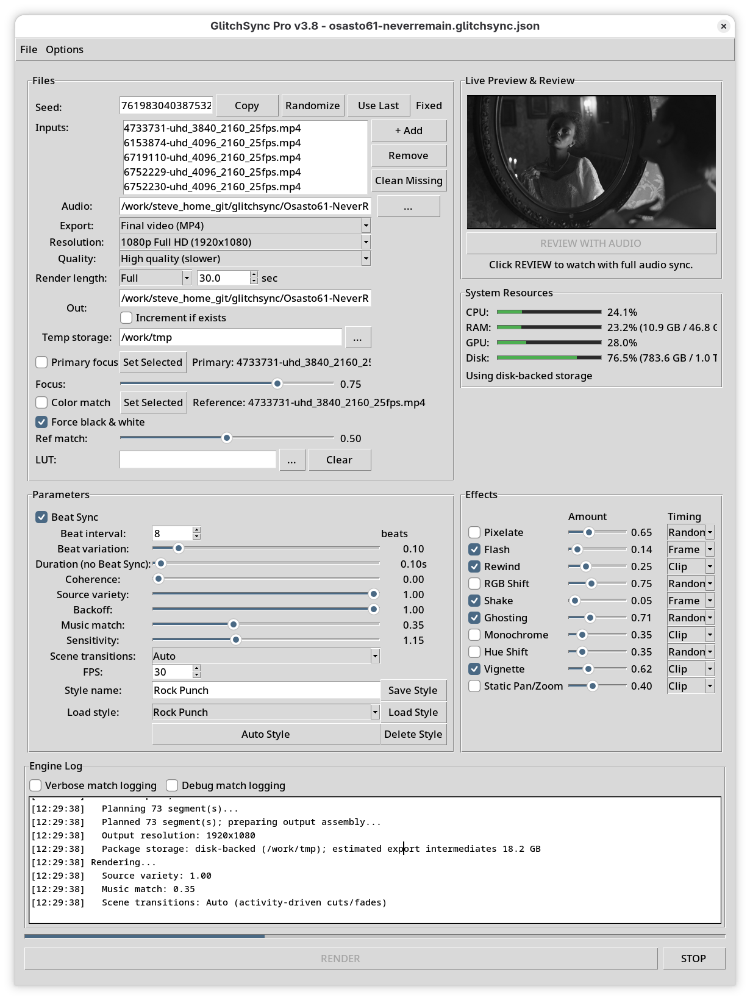

# GlitchSync Pro

Audio-reactive video glitch tool that synchronizes video cuts and visual effects to the beats and frequency transients of a music track.

Current version: **0.8.0**



## Launching

On Linux and macOS, run the included launcher:

```bash
./launch_glitchsync.sh
```

It creates a local `.venv`, installs the dependencies listed in `requirements.txt`, checks for updates on later launches, and opens the graphical interface. Pass `PYTHON_BIN=/path/to/python` when a different Python executable is required.

To install dependencies manually:

```bash
python3 -m pip install -r requirements.txt
python3 glitch_sync.py --gui
```

The launcher uses `opencv-python`; `cv2` is the Python import name for that package.

The `--version` option prints the installed application version.

## Features
- **Beat Synchronization**: Automatically detects BPM and aligns cuts to the rhythm.
- **Audio-Reactive Effects**:
  - **Pixelate**: Rhythmic block-glitch triggered by high-frequency transients.
  - **RGB Shift**: Chromatic aberration synced to audio peaks.
  - **Shake**: Bass-driven camera movement.
  - **Ghosting**: Temporal motion blur synced to mids.
  - **Monochrome**: Beat-reactive desaturation for black-and-white accent moments.
  - **Hue Shift**: High-frequency-triggered color rotation.
  - **Vignette**: Bass-reactive edge darkening for pulse emphasis.
  - **Static Pan/Zoom**: Optional slow zoom and subtle randomized pan on low-motion source segments.
  - **Flash**: Brightness bursts on transients.
  - **Rewind**: Stutter/rewind effects on intense peaks.
- **Per-Effect Amount and Timing Controls**: Fine tune each enabled effect independently and choose frame-wide timing, one averaged clip-wide value, or a per-clip random choice between the two.
- **Beat Interval and Variation**: Cut every N beats during Beat Sync, with optional extra cuts on skipped beats for variety.
- **One-Bar Default Pacing**: New projects default to a 4-beat interval, which corresponds to one bar in typical 4/4 music.
- **Duration Control**: When Beat Sync is off, set fixed edit lengths from 0 to 8 seconds.
- **Output Resolution Presets**: Use the first input's resolution automatically, or override to 480p, 720p, 1080p, 4K, or 8K.
- **Aspect-Safe Source Fitting**: Source videos are dark-edge cropped, scaled to cover, center-cropped, and overscanned for movement effects instead of being stretched or exposing transform borders.
- **Export Quality Presets**: Choose master quality, high quality, balanced, or fast preview encoding for final MP4 and cut-aware Shotcut exports.
- **Source Variety**: Bias clip selection toward under-used input videos during a render.
- **Source Backoff**: Temporarily discourage recently used sources so the next few cuts spread wider when needed.
- **Music Match**: Bias clip selection so louder, bass-heavy, or high-energy sections prefer brighter and higher-motion source regions.
- **Color Matching and LUTs**: Match clips toward a selected reference video's cached color profile with adjustable strength, or apply a user-supplied `.cube` LUT at full strength.
- **Saved Styles**: Load starter styles and save/delete named settings presets. New sessions and new projects start from the built-in Default style.
- **Auto Style**: Analyze the selected audio track and choose a built-in style from tempo, energy, bass, highs, and dynamics.
- **Snippet Rendering**: Render a short preview section, such as 30 seconds, before committing to a full export.
- **Render Abort**: Stop an in-progress render from the main controls.
- **Project Files**: New, save, save as, and load full project state, including media paths, output path, primary focus selection, style, and unsaved setting tweaks.
- **Input List Maintenance**: Remove selected input videos or clean missing file references from a loaded project.
- **Analysis Cache**: Reuses cached input video indexes and audio features between renders, with a File menu option to clear the cache.
- **Optional Primary Focus**: Select one input video as the primary visual source and bias the cut selection toward it while still allowing alternate videos for variation.
- **Live Render Preview**: Watch the video being built in real-time.
- **Professional Review**: One-click high-performance preview with full audio sync using `ffplay`.
- **Source Coherence**: Control how often the engine switches between different source videos.
- **Shotcut Export Modes**:
  - **Final video (MP4)**: Existing flattened MP4 export with audio muxed into the video.
  - **Cut-aware Shotcut MLT (ZIP)**: A Shotcut project archive with the rendered video split into editable timeline cuts and the original audio on its own track.
  - **Clip Shotcut MLT (ZIP)**: A Shotcut project archive with each rendered segment as its own video clip and the original audio on its own track.

## CLI Export Modes

Use `--export-mode final_video`, `--export-mode cut_aware_mlt`, or `--export-mode clip_mlt`.
Use `--export-quality "Master quality (largest)"`, `--export-quality "High quality (slower)"`, `--export-quality Balanced`, or `--export-quality "Fast preview"` to choose the final encoding preset.
Use `--beat-step 8 --beat-variation 0.2` with `--beat_sync` to make main cuts every 8 beats while allowing occasional extra cuts. Built-in styles keep beat intervals at 4 beats or higher, but the control remains user-editable.
Use `--backoff 0.5` to more aggressively penalize the most recently used source for the next few clips.
Use `--music-match 0.6` to bias source selection toward brighter and higher-motion clips during louder or more energetic audio sections.

The Shotcut modes create a ZIP archive containing `glitchsync_project.mlt` and relative `media/` files.

## Analysis Cache

GlitchSync stores reusable video and audio analysis data in `~/.cache/glitchsync/analysis`.
Video analysis includes brightness buckets, motion scores, and LAB color statistics for reference color matching.
The cache is keyed by source path, file size, modified time, and cache version, so changed source files or analysis upgrades are re-scanned automatically.
Use **File > Clear Analysis Cache...** to remove cached analysis files.
